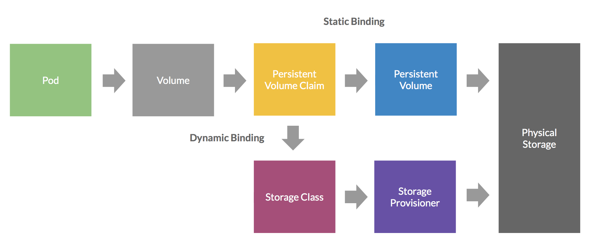

# Volumes

## Module Overview

At the end of this module, you will :

* _Learn to persist data thanks to external volumes_
* _Learn to manage the volumes and the claim_
* _Learn to access data within a container_

## Create

The Kubernetes basic architecture can be schematized like this :



## Get

## Describe

## Attach

## Explain

Kubernetes come with a lot of documentation about his objects and the available options in each one. This can be fin easily in command line or in the official Kubernetes documentation.

#### Exercise n°1

Get the documentation of a specific field of a resource.

```bash
kubectl explain persistentvolumes.spec
```

Add the --recursive flag to display all of the fields at once without descriptions.

## Delete

The _delete_ command delete resources by filenames, stdin, resources and names, or by resources and label selector.

A Volume can only be deleted if it is not attached to a Pod. Use with caution, a deleted volumes cannot be recover.

Note that the delete command does NOT do resource version checks, so if someone submits an update to a resource right when you submit a delete, their update will be lost along with the rest of the resource.

#### Exercise n°1

Delete the previous volumes deployed in the default namespace.

```bash
kubectl delete persistentvolume VOLUME_NAME
```

## Module exercise

Based on your reads, try to do it as simple as possible.



1.



```bash

```



## External documentation

Those documentations can help you to go further in this topic :

* Kubernetes official documentation on [volumes](https://kubernetes.io/docs/concepts/storage/volumes/)

